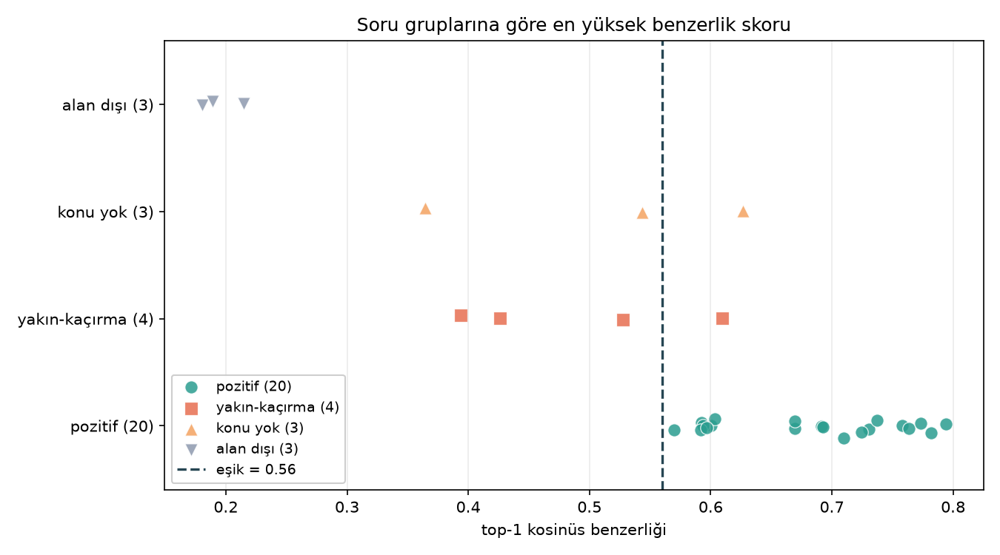
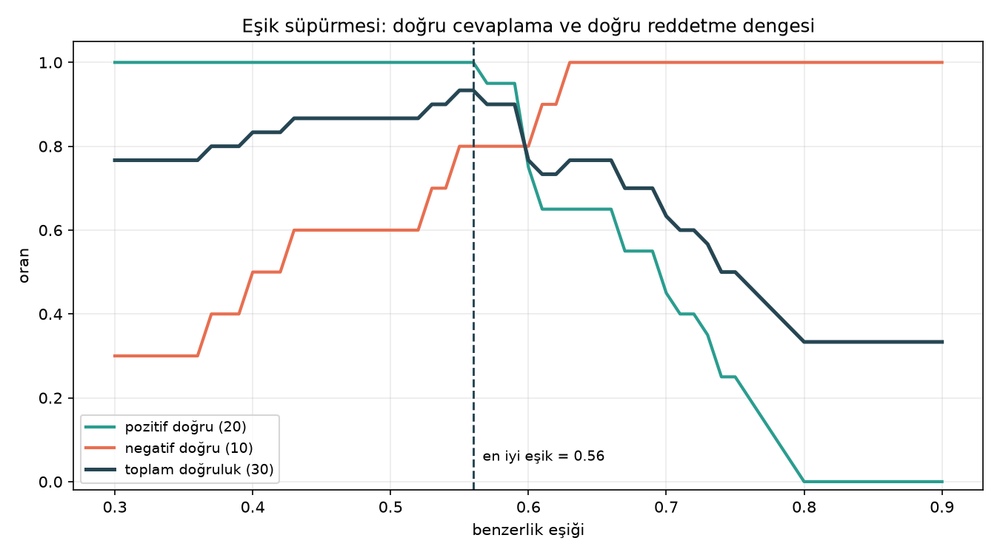

# 10. Hafta — Vektör Veri Tabanı

## Chunking stratejisi

Baştaki planım klasik token paketlemeydi: paragrafları `\n\n` ile böl, 350
token'a kadar paketle, %15 overlap bırak. Veriye bakınca iki varsayım da tutmadı.

Birincisi, metinlerde `\n\n` diye bir şey yok. Ayraç tek `\n`. Ama metin düz bir
blok da değil, belirgin bir bölüm yapısı var:

```
Pankreas ameliyatı denince pek çok kişinin aklına...        <- giriş
- Ameliyat Gerektirebilecek Pankreas Hastalıkları...        <- içindekiler
- Her Lezyon Ameliyat Gerektirir mi?                        <- içindekiler
Ameliyat Gerektirebilecek Pankreas Hastalıkları Nelerdir?   <- BAŞLIK
Pankreas Kistleri ve IPMN: Pankreasta rastlanan...          <- içerik
Her Lezyon Ameliyat Gerektirir mi?                          <- BAŞLIK
Kesinlikle hayır. Pankreas lezyonlarının bir bölümü...      <- içerik
```

İkincisi, 350 token bu metinler için çok büyük bir hedef. Tokenizer Türkçe'ye
özel olduğu için karakter/token oranı 5,77 çıkıyor (çok dilli modellerde ~3,2).
Bölümlerin gerçek boyutu ise şöyle:

| split | medyan | p75 | p90 | p99 | max |
|---|---|---|---|---|---|
| guven | 94 | 130 | 181 | 361 | 719 |
| medicana | 88 | 149 | 224 | 433 | 853 |
| liv | 67 | 101 | 141 | 256 | 413 |

350 token, bölümlerin %99'undan büyük. O hedefle paketleseydim birbiriyle
alakasız 3-5 bölümü tek chunk'a tıkmış olacaktım, yani tam kaçınmak istediğim
şeyi yapacaktım.

Bu yüzden token paketleme yerine bölüm tabanlı parçalamaya geçtim. Uygulanan
kural:

```
1. \n ile blokla
2. başlık işaretle:  len<120 ∧ ¬"- " ∧ ¬":" ∧ ("?" ∨ ¬".!")
3. içindekiler sil:  gövdede başlık olarak da geçen "- X" satırları
4. bölüm kur:        başlık + sonraki içerik blokları
5. chunk üret:
      bölüm <= 320 tok  ->  olduğu gibi
      bölüm >  320 tok  ->  blok sınırından böl, 48 overlap
                            tek blok 320'yi aşarsa cümleden böl
      bölüm <   48 tok  ->  komşu bölüme yapıştır
6. gömülecek metin:  "title: {makale} — {bölüm} | text: {içerik}"
   chunk_text sütununa ham içerik yazılır
```

Her şey başlık tespitine dayanıyor. Mantığı basit: başlıklar cümle değildir,
kısadırlar ve nokta ile bitmezler. `?` ile bitenler kesin başlık, bu sitelerin
ana kalıbı zaten bu. `:` ile bitenler ise tuzak; "En yaygın belirtiler
şunlardır:" başlık gibi duruyor ama altındaki listenin giriş cümlesi. Ölçtüğümde
14 split'in hepsinde bölümlerin %84-94'ünde başlık yakalandığını gördüm,
içindekiler menüsü olmayan `florence` ve `liv`'de bile.

`- ` işareti iki ayrı iş yapıyor: hem içindekiler menüsü hem gerçek madde
listesi. Hepsini silseydim mamografi avantajları, ameliyat özellikleri gibi
gerçek içeriği de silerdim. Ayırt etme kuralı şu: `- X` satırı, `X` gövdede
başlık olarak da geçiyorsa menüdür, geçmiyorsa içeriktir.

Sonuç olarak 402 makaleden 3.138 chunk çıktı. Medyan 106 token, p90 244, p99
307, max 320. Tavanı aşan yok, %89'u başlık taşıyor, sadece 11 tanesi 48
token'ın altında (tek bölümlük kısa makaleler, yapışacak komşusu yok).

Bu kurulumda overlap chunk'ların yalnızca %11'inde var. Overlap zaten keyfi bir
noktadan kesince anlamın ikiye bölünmesini telafi eden bir yama. Burada keyfi
noktadan kesmiyoruz, belgenin kendi başlık sınırından kesiyoruz, o yüzden sadece
istisnai büyük bölümlerde devreye giriyor. Chunk sınırını tokenizer değil,
belgenin yapısı belirliyor.

Yolda iki hata çıktı, ikisini de düzelttim:

| sorun | belirti | çözüm |
|---|---|---|
| tek blok tavanı aşıyor | dev paragraf bölünemiyor, 1.156 token'lık chunk | cümle seviyesinde yedek bölücü, max 509'a indi |
| overlap tavanı deliyor | taşınan kuyruk yeni bloğun üstüne biniyor | kuyruk tavanı aşacaksa overlap'ten vazgeç, max 320'ye indi |

## Embedding modeli

`magibu/embeddingmagibu-200m` kullandım. Gemma3 gövdeli, ~200M parametre.

| | |
|---|---|
| boyut | 768, L2-normalize |
| context | 8.192 token |
| pooling | mean + 2 dense (768 -> 3072 -> 768) |

Seçme sebebim Türkçe'ye özel uyarlanmış olması (cross-lingual tokenizer surgery
ve offline distillation ile). 8K context uzun bölümleri kesmeden alıyor ve 200M
parametre 8 GB VRAM'de rahat dönüyor, 3.138 chunk 18 saniyede gömüldü.

Modelin asimetrik olması yüzünden prompt kullanmak zorunlu.
`config_sentence_transformers.json` şunu diyor:

```
"query":    "task: search result | query: "
"document": "title: none | text: "
```

Chunk'ları `document`, soruları `query` prompt'uyla gömüyorum. Bu atlanırsa model
yine çalışıyor ama skor dağılımı kayıyor ve eşik analizi anlamsızlaşıyor.

`document` prompt'undaki `title: none` alanına gerçek başlığı koyuyorum. Hastane
metinleri anafora dolu ("Bu hastalıkta...", "Tedavi süreci..."), tek başına chunk
çoğu zaman neyden bahsettiğini söylemiyor. `chunk_text` sütunu ham kalıyor,
başlık yalnızca vektör üretiminde kullanılıyor.

Bir de float32 tercih ettim. Model varsayılan olarak bfloat16 yükleniyor, o
hassasiyette L2 normlar 0,996-1,004 arasında kayıyor ve "kosinüs = nokta
çarpımı" varsayımı tam tutmuyor. `normalize_embeddings=True` de çözmedi, çünkü
normalizasyon da bf16 içinde yapılıyor. float32'de normlar tam 1,0 (bf16 ile
kosinüs farkı 7e-5).

## Eşik analizi

### Test seti

20 pozitif soruyu chunk'lardan türettim, soru yazıp cevabını aramak yerine. Her
sorunun `gold_chunk_id`'si kayıtlı, böylece recall göz kararı değil ölçüm.

10 negatif soruyu bilerek üç gruba ayırdım:

| grup | n | ne test ediyor |
|---|---|---|
| `alan_disi` | 3 | felsefe, futbol, yazılım; kolay elenmeli |
| `konu_yok` | 3 | tıbbi ama bu 402 makalede geçmeyen konular |
| `yakin_kacirma` | 4 | aynı konu ailesinde ama korpusun cevaplamadığı soru (fiyat, doz, marka) |

Hepsi "Fenerbahçe kaç şampiyonluk aldı" tipinde olsaydı eşik analizi sahte
çıkardı, 0.2 de 0.6 da aynı sonucu verirdi. Eşiği fiilen belirleyen
`yakin_kacirma` grubu.

Bu arada korpusu bilerek dar tuttum (ödev 100-1.000 makale arasına izin
veriyordu, ben 402 aldım). Korpus ne kadar genişse "bu konu kesinlikle yok"
diyebilmek o kadar zorlaşıyor; 25.000 makalelik havuzda aklınıza gelen her tıbbi
konu bir yerde geçiyordur ve negatif sorularınız aslında pozitif çıkar. Dürüst
bir eşik analizi için kapsamın dar ve bilinen olması şart.

### Ölçüm

Eşiği baştan seçmedim, 0.30-0.90 arasını 0.01 adımla süpürdüm:

| eşik | pozitif ✓ | negatif ✓ | toplam |
|---|---|---|---|
| 0.50 | 20/20 | 6/10 | 26/30 |
| 0.53 | 20/20 | 7/10 | 27/30 |
| 0.55 | 20/20 | 8/10 | 28/30 |
| 0.56 | 20/20 | 8/10 | 28/30 |
| 0.57 | 19/20 | 8/10 | 27/30 |
| 0.60 | 15/20 | 8/10 | 23/30 |
| 0.63 | 13/20 | 10/10 | 23/30 |

Skor dağılımları:

| grup | min | medyan | max | 0.56'da doğru |
|---|---|---|---|---|
| pozitif (20) | 0.5696 | 0.6920 | 0.7943 | 20/20 |
| alan dışı (3) | 0.1803 | 0.1892 | 0.2147 | 3/3 |
| konu yok (3) | 0.3647 | 0.5438 | 0.6267 | 2/3 |
| yakın-kaçırma (4) | 0.3939 | 0.4771 | 0.6095 | 3/4 |




Not: Chroma varsayılanda L2 mesafesi kullanıyor, kosinüs için
`metadata={"hnsw:space": "cosine"}` vermek gerekiyor. Ayrıca Chroma benzerlik
değil `distance` döndürüyor, o yüzden `benzerlik = 1 - distance`. Eşiği distance
sanıp `< 0.7` yazsaydım tam ters filtre kurmuş olurdum. Chroma yaklaşık (ANN)
arama yaptığı için de 30 sorunun tamamında sonucu numpy'la hesapladığım kesin
kosinüsle karşılaştırdım, sapma 0/30.

### Seçilen eşik: 0.56

0.55-0.56 platosu 28/30 veriyor. Plato ortasını seçtim, bu aynı zamanda karar
boşluğunun da ortası:

```
en yüksek doğru elenen negatif : 0.5438  (kuduz aşısı dozu)
                        eşik   : 0.5600
en düşük pozitif               : 0.5696  (sepsis ilk müdahale)
```

Marj her iki yönde ~0.013. Dar, ama 30 soruluk bir sette bu kadarı beklenir.

### "İlk 5" ölçütü

İlk denemede pozitif doğruluğunu "gold chunk 1. sırada" diye ölçtüm, 13/20 çıktı
ve en iyi eşik 21/30 göründü. Ölçüt yanlıştı: LLM'e ilk 5 chunk birden
veriliyor, gold'un 1. mi 3. mü olduğu cevabın doğruluğunu değiştirmiyor. Üstelik
aynı makalenin kardeş chunk'ları çoğu zaman gold kadar geçerli kaynak, onları
hata saymak eşiği değil sıralamayı ölçmek olurdu. Düzeltilmiş ölçütle gold chunk
20/20 soruda ilk 5'te (top-1'de 13/20).

### Eşiğin yapamadığı: kalan 2 hata

İki negatif soru eşikle elenemiyor:

"Sıtma hangi sivrisinek türüyle bulaşır?" 0.6267 alıyor. Korpusta sıtma yok ama
"Sivrisinek Isırığına Ne İyi Gelir?" makalesi var, vektör konu yakınlığını
görüyor.

"Laparoskopik kolesistektomi Medipol'de kaç TL?" 0.6095 alıyor. Korpusta
kolesistektomi var, sadece fiyat bilgisi yok.

Yani eşik konu yokluğunu filtreliyor, bilgi yokluğunu filtrelemiyor. Kosinüs
benzerliği "bu metin bu soruyla aynı konuda mı" sorusunu cevaplıyor, "bu metin
bu sorunun cevabını içeriyor mu" sorusunu değil. Bu vektör aramanın yapısal
sınırı, ayar hatası değil.

Kapatmanın yolu ikinci bir kapı koymak: chunk'lar eşiği geçtikten sonra LLM'e
"verilen metinde cevap yoksa bilmiyorum de" talimatı ve çıktının kaynağa karşı
doğrulanması. 8. haftada kurduğum guardrail deseninin aynısı. Eşik gürültünün
%80'ini kesiyor, guardrail kalanı yakalıyor.
