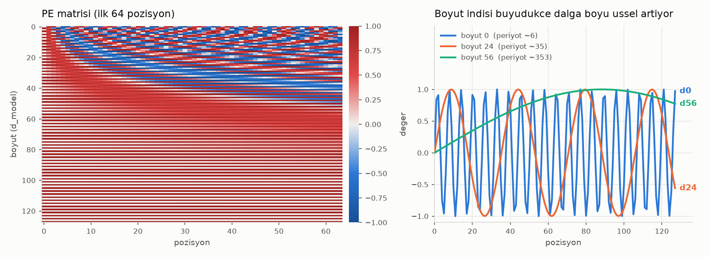
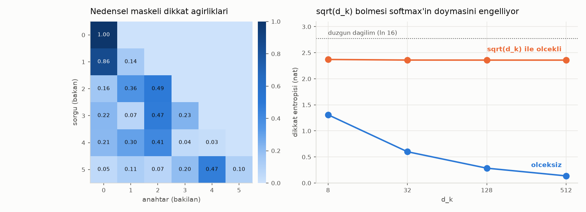
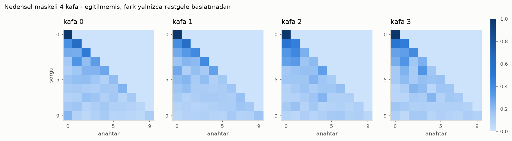
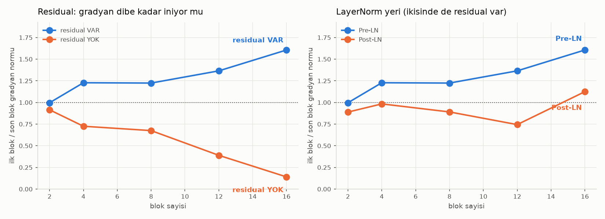

# Görev 4–7: Transformer Bileşenleri

Sıfırdan yazılmış Positional Encoding, Scaled Dot-Product Attention,
Multi-Head Attention ve Transformer Block. Dördü de `4_mini_gpt/` tarafından
**import edilerek** kullanılıyor — kopya yok.

```bash
# proje_persona/2_transformer içinden
../../.venv/bin/python test_gorevler.py      # 34 kontrol + görseller
../../.venv/bin/python pozisyon_kodlama.py   # tek tek de çalışır
../../.venv/bin/python dikkat.py
../../.venv/bin/python cok_kafali_dikkat.py
../../.venv/bin/python transformer_blok.py
```

**34/34 kontrol geçiyor.** Aşağıdaki bütün sayılar `test_gorevler.py`
çıktısından.

| Dosya | Sınıflar |
|---|---|
| `pozisyon_kodlama.py` | `PositionalEncoding`, `GommeVePozisyon` |
| `dikkat.py` | `ScaledDotProductAttention`, `nedensel_mask`, `dolgu_mask` |
| `cok_kafali_dikkat.py` | `MultiHeadAttention` |
| `transformer_blok.py` | `TransformerBlock`, `FeedForward`, `BlokYigini` |

---

## Görev 4 — Positional Encoding

```
PE[pos, 2i]   = sin(pos / 10000^(2i/d_model))
PE[pos, 2i+1] = cos(pos / 10000^(2i/d_model))
```

Öğrenilebilir parametre yok; matris bir kez hesaplanıp `register_buffer` ile
tutuluyor — parametre değil ama modelin durumu, `state_dict`'e girer ve
`.to(device)` ile taşınır.

Doğrulamalar: `pos=0`'da çift indisler tam 0 (`sin 0`), tek indisler tam 1
(`cos 0`), bütün değerler `[-1, 1]` içinde, her pozisyon vektörünün normu sabit
(`8.0 = sqrt(128/2)`).



Sağdaki panel formülün asıl fikrini gösteriyor: boyut indisi büyüdükçe dalga
boyu **üssel** artıyor (d0 → periyot ~6, d24 → ~35, d56 → ~353). Yani model
farklı boyutlarda farklı ölçekte konum bilgisi taşıyor — kısa dalga boyları
komşuluğu, uzun dalga boyları belgedeki kaba konumu kodluyor.

### Rapor: neden positional encoding'e ihtiyaç duyuyoruz?

Bunu iddia etmek yerine ölçtüm. Self-attention **permütasyona eşdeğer** bir
işlem: girdiyi karıştırırsanız çıktı da aynı şekilde karışır, başka hiçbir şey
değişmez. Test: aynı token dizisini karıştır, self-attention'dan geçir, sonra
sırayı geri al ve orijinalle karşılaştır.

| | Karıştır → geri al → maks. fark |
|---|---|
| PE **yok** | **4.77e-07** (sayısal gürültü) |
| PE **var** | **1.9695** |

PE'siz fark float hassasiyeti seviyesinde — model "kar yağdı sokağa" ile
"sokağa yağdı kar" arasında **hiçbir fark görmüyor**. RNN'de sıra, işlemin
kendisinden geliyordu (adım adım okuyorsunuz); Transformer bütün pozisyonlara
aynı anda baktığı için sıra bilgisi dışarıdan verilmek zorunda.

PE **toplanıyor**, birleştirilmiyor (concat): boyutu büyütmüyor ve embedding
uzayının aynı eksenlerini paylaşıyor, hangi bileşenin ne kadarını kullanacağını
model kendisi öğreniyor.

### Yan bulgu: ölçek uyuşmazlığı

`nn.Embedding` varsayılan `N(0,1)` başlatmasıyla ve orijinal makaledeki
`sqrt(d_model)` çarpanıyla:

```
gömme std = 11.18    PE std = 0.52    oran = 21.5x
```

Yani pozisyon sinyali içeriğin yanında çok küçük kalıyor. Orijinal makalede
embedding'ler eğitildikçe bu dengeleniyor, ama sıfırdan eğitilen küçük bir
modelde başlangıç dengesizliği eğitimi yavaşlatır. **MiniGPT bu yüzden
öğrenilebilir pozisyon gömmesi kullanacak** (nanoGPT gibi, `std=0.02`) — sinüs
PE burada ödevin istediği gibi implement edildi ve doğrulandı.

---

## Görev 5 — Scaled Dot-Product Attention

```
Attention(Q, K, V) = softmax( QK^T / sqrt(d_k) + mask ) V
```



### Mask

Mask softmax'tan **önce** uygulanıyor. Sonradan sıfırlamak yanlış olurdu:
softmax normalizasyonu bozulur, satır toplamı 1 olmaz.

`-inf` yerine `torch.finfo(dtype).min` kullanılıyor — tamamen maskeli bir satır
oluşursa `-inf` softmax'ta `NaN` üretir.

Ölçüm: causal mask'ta üst üçgen ağırlıklarının maksimumu **tam 0.0**, satır
toplamları hâlâ 1, ilk token yalnızca kendini görüyor (1.0000). Padding mask
de ayrıca test edildi (dolgu ağırlıkları toplamı 0.0).

### Neden `sqrt(d_k)`

`q, k ~ N(0,1)` ise nokta çarpımının varyansı `d_k` ile büyür. Ölçeklenmezse
skorlar yayılır, softmax doyar, gradyan kaybolur. 256 rastgele çekimin
ortalaması:

| `d_k` | skor std (ham → ölçekli) | entropi (ham → ölçekli) | maks ağırlık (ham → ölçekli) |
|---|---|---|---|
| 8 | 2.82 → 1.00 | 1.310 → 2.371 | 0.561 → 0.240 |
| 32 | 5.65 → 1.00 | 0.600 → 2.359 | 0.781 → 0.246 |
| 128 | 11.30 → 1.00 | 0.285 → 2.359 | 0.888 → 0.246 |
| 512 | 22.61 → 1.00 | **0.137** → 2.358 | **0.945** → 0.246 |

Düzgün dağılımın entropisi (16 token) 2.773 nat. Ölçeksiz sütunda `d_k=512`'de
entropi 0.137'ye çöküyor — dikkat neredeyse tek bir token'a kilitleniyor.
Ölçekli sütunda entropi `d_k`'dan **bağımsız** kalıyor; amaç tam olarak buydu.

> İlk ölçümümde tek bir rastgele çekim kullanmıştım ve trend monoton
> çıkmıyordu (`d_k=512`, `d_k=128`'den yüksek entropi veriyordu). 256 örneğin
> ortalaması alınınca gerçek eğilim ortaya çıktı.

### Rapor: attention bu örnekte neye odaklandı?

Elle kurulmuş, yorumlanabilir bir test: 5 token, hepsi birbirine **dik**
(ortonormal), dolayısıyla aralarındaki benzerlik tam olarak 0. Sorgular bilerek
seçildi, yani beklenti koddan değil kurulumdan geliyor.

| sorgu | t0 | t1 | t2 | t3 | t4 |
|---|---|---|---|---|---|
| = 2. token'ın anahtarı | 0.036 | 0.036 | **0.858** | 0.036 | 0.036 |
| = (1. + 3.) / √2 | 0.046 | **0.432** | 0.046 | **0.432** | 0.046 |

Birinci sorgu tam eşleştiği token'a %86 ağırlık veriyor. İkinci sorgu iki
token'ın karışımı olduğu için ağırlığı **tam olarak eşit** böldü (0.432 /
0.432) — attention'ın "ağırlıklı ortalama" olduğunun doğrudan gösterimi.

> İlk denemede birim normlu vektörler kullandım ve kontrast neredeyse yoktu
> (0.263 vs 0.184): eşleşme logiti `1/sqrt(8) = 0.35`'te kalıyor, softmax
> düz çıkıyor. Vektörleri `α=3` ile ölçekleyince tablo yukarıdaki hâlini aldı.
> Buradan çıkan ders ölçümün kendisinden daha genel: **dikkatin keskinliği Q/K
> normuna bağlı** — LayerNorm'un attention'dan önce durmasının sebeplerinden
> biri bu.

---

## Görev 6 — Multi-Head Attention

`n_head=4`, `d_model=128` için boyut akışı:

| adım | şekil | açıklama |
|---|---|---|
| girdi `x` | `(2, 10, 128)` | `(B, S, d_model)` |
| `w_q(x)` | `(2, 10, 128)` | projeksiyon, boyut aynı |
| `view(B, S, n_head, d_k)` | `(2, 10, 4, 32)` | son eksen bölündü |
| `transpose(1, 2)` | `(2, 4, 10, 32)` | `(B, n_head, S, d_k)` |
| ağırlıklar | `(2, 4, 10, 10)` | her kafa için ayrı |
| birleştir | `(2, 10, 128)` | kafalar geri toplandı |
| `w_o(...)` | `(2, 10, 128)` | **girdiyle aynı şekil** |

`d_k = 128 / 4 = 32`. `transpose` sonrası bellek bitişik olmadığı için
`view`'dan önce `contiguous()` gerekiyor.

Doğrulamalar:

- Ağırlık satır toplamı 1 (bütün kafalarda)
- **`n_head=1` tek kafalı attention'a birebir eşit** — maks fark `0.00e+00`
- Causal mask bütün kafalarda geçerli (üst üçgen maks 0.0)



### Rapor: Multi-Head kullanmanın avantajı nedir?

Tek attention, her pozisyon için **tek bir** ağırlıklı ortalama üretir. Farklı
ilişki türlerini — sözdizimsel bağımlılık, konu benzerliği, yerel komşuluk —
aynı anda temsil edemez; hepsi tek dağılıma sıkışır. Multi-head bunu `d_model`'i
bölüp her parçada ayrı bir attention çalıştırarak çözüyor.

Kritik nokta: **maliyet artmıyor.**

| `n_head` | `d_k` | parametre |
|---|---|---|
| 1 | 128 | 66.048 |
| 2 | 64 | 66.048 |
| 4 | 32 | 66.048 |
| 8 | 16 | 66.048 |
| 16 | 8 | 66.048 |

Kafalar uzayı **bölüyor**, büyütmüyor. 4 kafa, 4 kat parametre demek değil;
aynı 128 boyutun 32'şerlik dört dilimde bağımsız kullanılması demek.

Görseldeki dört kafa **eğitilmemiş** — aralarındaki fark yalnızca rastgele
başlatmadan geliyor (entropileri 2.258–2.266 nat, hepsi düzgün dağılıma yakın).
Bu ölçüm kafaların uzmanlaştığını değil, **bağımsız parametrelendiğini**
doğruluyor; uzmanlaşma eğitimde ortaya çıkar. Bunu README'de ayırmak önemli,
çünkü eğitilmemiş kafalardan "farklı şeylere bakıyorlar" sonucu çıkarmak
yanlış olurdu.

---

## Görev 7 — Transformer Block

Bir blok: Multi-Head Attention + Feed-Forward, her ikisi de LayerNorm ve
residual ile sarılı. Blok **şekli koruyor** — üst üste konabilmesinin şartı bu.

Parametre dağılımı (`d_model=128`, `d_ff=512`):

| bileşen | parametre | pay |
|---|---|---|
| MultiHeadAttention | 66.048 | %33.3 |
| FeedForward | 131.712 | **%66.4** |
| 2× LayerNorm | 512 | %0.3 |
| **toplam** | **198.272** | |

Parametrelerin üçte ikisi FFN'de. Attention token'lar **arasında** bilgi taşır;
FFN her token'ı **kendi içinde** işler.

Üst üste koyma testi: 1, 3, 6, 12 blok — hepsi çalışıyor, çıktı şekli korunuyor
(12 blok = 2.379.520 parametre).



### Rapor: Residual Connection neden önemlidir?

Ölçülen: **ilk bloğun gradyan normu / son bloğun gradyan normu.** 1'e yakın =
eğitim sinyali dibe kadar sağlıklı iniyor; 0'a yakın = ilk katmanlar sinyal
almıyor, yani eğitilmiyor.

| blok sayısı | residual **var** | residual **yok** |
|---|---|---|
| 2 | 0.996 | 0.915 |
| 4 | 1.228 | 0.725 |
| 8 | 1.224 | 0.675 |
| 12 | 1.365 | 0.389 |
| 16 | **1.606** | **0.140** |

Residual yokken oran derinlikle çöküyor: gradyan her katmanda ağırlık
matrisleriyle çarpılarak geriye gidiyor ve sönüyor. 16 katmanda ilk blok son
bloğun aldığı sinyalin ancak %14'ünü alıyor.

Residual varsa `d(çıktı)/d(girdi) = I + (...)` olduğu için **en az bir birim
geçiş** her zaman kalıyor — gradyan için kesintisiz bir "otoyol". Oran 1'in
üstüne çıkıyor, yani ilk katman en az son katman kadar sinyal alıyor.

> **Bu ölçümü iki kez düzelttim ve ikisi de öğretici.**
>
> İlk hâlinde yığın sonundaki `LayerNorm` duruyordu ve kayıp
> `çıktı.pow(2).mean()` idi. LayerNorm çıktıyı birim varyansa çektiği için bu
> kayıp parametrelerden neredeyse **bağımsız** — bütün gradyanlar `1e-6`
> mertebesinde gürültü çıkıyordu. Üstelik residual aktivasyonları büyüttüğü
> için LayerNorm onun gradyanını daha çok kısıyor ve sonuç **tersine
> dönüyordu**: residual'siz ağ daha büyük gradyan veriyor gibi görünüyordu.
>
> İkinci sorun: mutlak norm karşılaştırmak da yanıltıcı, çünkü residual'li ve
> residual'siz ağlar farklı ölçekte aktivasyon üretiyor. Derinliğin etkisini
> yalıtmak için **aynı ağın** ilk/son katman oranına geçildi.
>
> Düzeltilmiş ölçüm: yığın elle kuruluyor (son LayerNorm yok), gerçek bir
> hedefe karşı MSE kaybı alınıyor.

### Pre-LN mi Post-LN mi

Ödev "LayerNorm (önce ve sonra)" diyor. İki yerleşim mümkün:

```
Post-LN (orijinal, 2017) : x = LN(x + AltKatman(x))
Pre-LN  (modern, GPT-2+) : x = x + AltKatman(LN(x))
```

Fark ince ama sonucu büyük: Pre-LN'de girdiden çıktıya **kesintisiz** bir
toplama yolu var; Post-LN'de her katmandaki LayerNorm o yolu kesiyor.

| blok sayısı | Pre-LN | Post-LN |
|---|---|---|
| 2 | 0.996 | 0.889 |
| 6 | 1.230 | 0.882 |
| 12 | 1.365 | 0.744 |
| 24 | **1.850** | 0.790 |

**Varsayılan Pre-LN.** MiniGPT 3 katmanı warmup'sız `lr=1e-3` ile eğitecek;
Post-LN bu ayarda kararsızlaşmasıyla bilinir. Her iki mod da `pre_ln`
parametresiyle açık, tablo ikisini de koşarak üretiliyor.

Pre-LN'de son bloğun çıktısı hiç normalize edilmeden çıkar; bu yüzden
`BlokYigini` sonunda tek bir LayerNorm var (GPT-2'deki `ln_f`).
