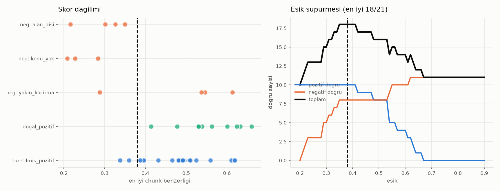

# RAG Persona Chatbot

Sagopa Kajmer'in şarkı sözleri vektörleştirildi; gelen mesajla en alakalı
bölümler çekilip bir LLM'e persona promptuyla veriliyor. Bot sözleri
**alıntılamıyor**, onların felsefesiyle kendi cümlelerini kuruyor — ve bu bir
prompt kuralı değil, yayın öncesi ölçülen bir koşul.

```bash
# proje_persona/3_rag_persona içinden
../../.venv/bin/python 1_chunkla_gom.py     # chunk + embed + ChromaDB
../../.venv/bin/python 2_esik_analizi.py    # eşik süpürmesi + görseller
../../.venv/bin/python 3_degerlendir.py     # guardrail ölçümü

# servis + arayüz (iki terminal)
../../.venv/bin/python -m uvicorn api:app --port 8000   # -> /docs
../../.venv/bin/python arayuz.py                        # -> :7860
```

| Dosya | İş |
|---|---|
| `chunklama.py` | Bar sınırından chunk'lama kuralı |
| `1_chunkla_gom.py` | Gömme + ChromaDB indeksi + HNSW doğrulaması |
| `retriever.py` | Ortak arama katmanı (Chroma + eşik) |
| `2_esik_analizi.py` | Test seti, eşik süpürmesi, görseller |
| `persona.py` | Prompt, LLM arka uçları, **guardrail** |
| `3_degerlendir.py` | Guardrail ölçümü |
| `api.py` | FastAPI — `POST /api/v1/chat` |
| `arayuz.py` | Gradio, API'ye HTTP ile bağlanır |

---

## Aşama 1 — Chunking ve vektör veritabanı

### Chunk sınırı belgeden okunamıyor, kurulmak zorunda

10. haftada bölüm sınırı belgenin kendisinden geliyordu (başlıklar). Burada
öyle bir sinyal yok — ölçüldü:

| | |
|---|---|
| Boş satırla ayrılmış kıta | 260 şarkının **1'inde** |
| `[Nakarat]` / `(x2)` etiketi | **hiçbirinde** |
| Satır (bar) / şarkı | medyan 24 |
| Bar uzunluğu | medyan **39**, p90 54 karakter |

Elimizdeki tek yapısal birim **bar**. Bar medyanı 39 karakter olduğu için
6 barlık grup ≈ 230 karaktere denk geliyor ve ödevin istediği 200–400
aralığına doğal olarak oturuyor.

```
1. barlara ayır (boş satırları at)
2. 6'şarlı ardışık gruplar kur
3. son grup 4 bardan kısaysa öncekine yapıştır
4. grup 400 karakteri aşarsa ikiye böl
5. gömülecek metin: "title: {şarkı} | text: {barlar}"
```

**Overlap yok** ve bu bilinçli. 10. haftada öğrenilen şey burada da geçerli:
overlap, keyfi bir noktadan kesince anlamın ikiye bölünmesini telafi eden bir
yamadır. Ama şarkı sözünde tekrar çok (nakaratlar); overlap eklemek aynı
dizeleri veritabanına üç-dört kez koyup arama sonuçlarını tek bir nakaratla
doldururdu.

Sonuç: **1.127 chunk**, medyan 239 karakter, p10/p90 158/310, maks 448.
**%73'ü** ödevin 200–400 aralığında; altta kalan 299 chunk kısa barlı
şarkılardan geliyor.

### Gömme ve indeks

`magibu/embeddingmagibu-200m` (10. haftadan devir): 768 boyut, Türkçe'ye
uyarlanmış, asimetrik prompt (`document` / `query`), float32.

| | |
|---|---|
| Gömme süresi | 6.7 sn (1.127 × 768, RTX 4060) |
| L2 norm | 1.000000 – 1.000000 |
| ChromaDB | 1.127 kayıt, `hnsw:space=cosine` |

İki tuzak 10. haftadan taşındı ve yine geçerli: Chroma'nın varsayılan mesafesi
**L2**, kosinüs açıkça belirtilmeli; ve Chroma **distance** döndürüyor,
benzerlik değil (`benzerlik = 1 - distance`).

**HNSW doğrulaması:** Chroma yaklaşık (ANN) arama yapıyor. Eşik analizi buna
dayandığı için ilk 5 sonuç numpy ile hesaplanan kesin kosinüsle karşılaştırıldı
— fark **6e-08 ile 2e-07** arasında.

---

## Aşama 2 — Eşik analizi

Eşik baştan seçilmedi, 0.20–0.90 arası 0.01 adımla süpürüldü.

### Test seti

| grup | n | ne test ediyor |
|---|---|---|
| türetilmiş pozitif | 20 | Chunk'lardan **otomatik** üretilen sorgular, `gold_chunk_id` var |
| doğal pozitif | 10 | Elle yazılan gerçekçi kullanıcı mesajları |
| negatif / `alan_disi` | 4 | Futbol, Python, yemek tarifi, hava durumu |
| negatif / `konu_yok` | 3 | Kuantum, Osmanlı tımar sistemi, diyabet dozu |
| negatif / `yakin_kacirma` | 4 | Sanatçıyla ilgili **ama** sözlerinde olmayan (bilet fiyatı, şirket kuruluş yılı) |

10. haftadan devralınan ders: hepsi "Fenerbahçe kaç şampiyonluk" tipinde
olsaydı analiz sahte çıkardı — 0.2 de 0.6 da aynı sonucu verirdi. Eşiği fiilen
belirleyen `yakin_kacirma` grubu.

### Skor dağılımları

| grup | n | min | medyan | maks |
|---|---|---|---|---|
| türetilmiş pozitif | 20 | 0.3751 | 0.4799 | 0.5824 |
| doğal pozitif | 10 | 0.4141 | 0.5632 | 0.6607 |
| negatif / alan dışı | 4 | 0.2165 | 0.3261 | 0.3495 |
| negatif / konu yok | 3 | 0.2086 | 0.2273 | 0.2838 |
| negatif / yakın-kaçırma | 4 | 0.2877 | 0.5458 | 0.6137 |



### 10. haftanın yöntemi burada zayıf kaldı

Türetilmiş pozitifler chunk'tan **en nadir kelimeler** seçilerek üretiliyor,
yani doğru cevabı bilinen sorgular. 10. haftada bu yöntem 20/20 recall
vermişti. Burada:

```
gold chunk ilk 1'de : 4/20
gold chunk ilk 5'te : 7/20
```

Sebep iki katlı. Birincisi korpus: şarkı sözlerinde nakarat ve tema tekrarı
çok, birçok chunk anlamca neredeyse aynı — "doğru" chunk tekil olarak
ayırt edilebilir değil. İkincisi sorgu biçimi: nadir kelime torbası, cümle
üzerine eğitilmiş asimetrik bir semantik model için doğal bir sorgu değil.

Bu yüzden **iki süpürme** yapıldı:

| süpürme | pozitif kaynağı | seçilen eşik | skor |
|---|---|---|---|
| hepsi | türetilmiş + doğal (30) | 0.35 | 37/41 |
| **işletme** | **yalnız doğal mesajlar (10)** | **0.38** | **18/21** |

İşletme eşiği ikincisinden alındı: uygulamanın gerçek girdisi doğal kullanıcı
mesajı, kelime torbası değil. Türetilmiş sorguları pozitif saymak eşiği yapay
olarak aşağı çekiyordu.

### Seçilen eşik: 0.38

Plato 0.35–0.41 (18/21); plato ortası seçildi ve bu aynı zamanda karar
boşluğunun ortası:

```
en yüksek doğru elenen negatif : 0.3495   (hava durumu)
                        eşik   : 0.3800
en düşük geçen pozitif         : 0.4141
```

Kalan 3 hata `yakin_kacirma` grubundan: sanatçının adı geçen ama sözlerinde
karşılığı olmayan sorular (konser bileti fiyatı, en çok dinlenen şarkı) eşiği
geçiyor. 10. haftadaki bulgunun aynısı: **eşik konu yokluğunu filtreliyor,
bilgi yokluğunu filtrelemiyor.** Kosinüs benzerliği "bu metin bu soruyla aynı
konuda mı" sorusunu cevaplıyor, "bu metin bu sorunun cevabını içeriyor mu"
sorusunu değil.

---

## Aşama 3 — Persona ve guardrail

Akış: `retriever` → eşik → prompt → LLM → **guardrail** → yanıt.

### İki guardrail, ikisi de harness'ta

Ödev iki kural koyuyor ve ikisi de sistem promptunda yazılı. 7. ve 8. haftada
öğrenilen şey: bu yetmiyor. Her ikisi de koda taşındı.

**1. "Şarkı sözlerini doğrudan yapıştırma."** Yanıt yayınlanmadan önce
getirilen chunk'larla karşılaştırılıyor; birebir örtüşen en uzun parça
40 karakteri aşarsa yanıt reddedilip, ihlal modele geri bildirilerek yeniden
ürettiriliyor (2 deneme). Eşik 40, Sagopa'nın bar medyanının (39) hemen üstü —
yani "tam bir dize" uzunluğu.

**2. "Bilmediğin konuda bilgi uydurma."** Bu, ölçüm sırasında **fiilen
başarısız oldu.** `Fenerbahçe kaç şampiyonluk kazandı?` sorusunda eşik doğru
çalıştı ve hiçbir chunk getirmedi; ama prompt'ta açıkça "bilgi uydurma"
yazmasına rağmen model soruyu cevapladı ("19 şampiyonluk") ve üstüne persona
tonu ekledi.

Çözüm 8. haftadakiyle aynı: kuralı prompt'tan harness'a taşımak. **Bağlam
yoksa LLM hiç çağrılmıyor**; persona üslubunda sabit bir savuşturma dönüyor,
halüsinasyon ihtimali tanım gereği sıfır. Prompt'lu sürüm ölçüm için
`PersonaChatbot(baglamsiz_llm=True)` ile duruyor.

### LLM arka ucu

7. ve 8. haftadaki sözleşme: `TOOL_BACKEND=api|yerel`, `TOOL_MODEL`,
`HF_PROVIDER`, `TOOL_BASE_URL`/`TOOL_API_KEY`.

Ölçüm sırasında HF Inference Providers aylık kredisi bitti (**402 Payment
Required**) ve koşu ortasında kesildi. Bu yüzden `LLM.tamamla()` 402 görünce
otomatik olarak yerel arka uca düşüyor — koşu yarıda kalmıyor. Yerel model
`unsloth/Qwen2.5-7B-Instruct-bnb-4bit`: 7. ve 8. haftadan cache'te hazır
(5.2 GB) ve 8 GB VRAM'e sığıyor. Tam hassasiyetli sürümü indirip yerelde
kırpmak ~15 GB indirme demekti.

---

## Aşama 3 (devam) — FastAPI katmanı

```
POST /api/v1/chat
  →  {"user_id": "...", "message": "..."}
  ←  {"status": "...", "persona": "...", "reply": "...", "retrieved_context": [...]}
```

`status` üç değerden biri: `ok`, `baglam_yok`, `guardrail_reddetti`.

| uç | iş |
|---|---|
| `POST /api/v1/chat` | Ödevin istediği sözleşme |
| `POST /api/v1/chat/ayrintili` | Aynı iş + benzerlikler, guardrail denemesi, en uzun kopya, süre |
| `GET /api/v1/saglik` | Eşik, chunk sayısı, aktif LLM arka ucu |
| `/docs` | Swagger UI |

1_fastapi'de öğrenilenler burada kullanıldı: `extra="forbid"` (yazım hatası
sessizce yutulmasın), `Field` kısıtları (`message` 1–1000 karakter),
`Literal` ile `status`, ve `response_model` ile ölçüm alanlarının
kırpılması — `AyrintiliYanit` bunları açıkça isteyen ayrı bir uç.

Model ve Chroma bağlantısı `lifespan` içinde açılışta kuruluyor; ilk
kullanıcının gömme modelinin yüklenmesini beklemesi gerekmiyor.

CORS: arayüz `:7860`, API `:8000` — farklı origin. Gradio, Streamlit ve statik
HTML portları açıkça izinli (`allow_origins=["*"]` değil).

---

## Aşama 4 — Arayüz

Gradio sohbet arayüzü, API'ye **HTTP ile** bağlanıyor — modeli doğrudan
çağırmıyor. Ödev "FastAPI sunucunuza bağlanan bir arayüz" istiyor; iki katmanın
gerçekten ayrı olduğunu gösteren şey bu, ve CORS'un neden gerektiğini de
somutlaştırıyor.

Arayüz her yanıtta ölçüm değerlerini gösteriyor: kaç bölüm kullanıldı,
benzerlikler, en uzun birebir örtüşme kaç karakter, guardrail kaç kez yeniden
ürettirdi. Eşiğin altında kalan mesajlarda LLM'in hiç çağrılmadığı da açıkça
yazıyor.
