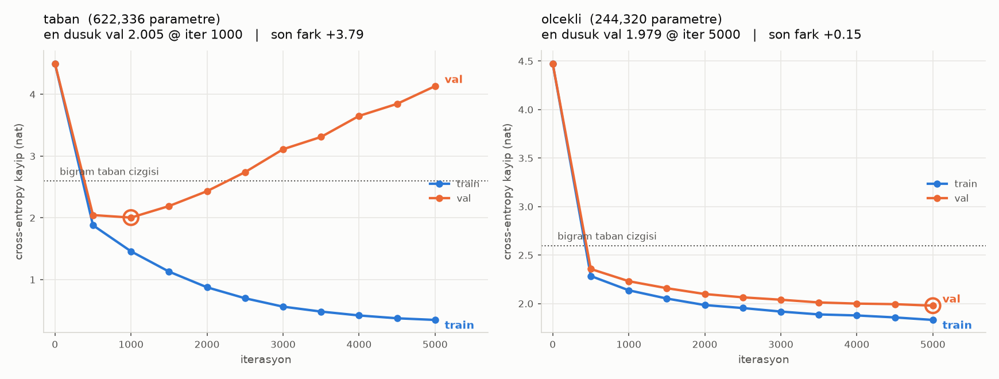

# MiniGPT — Karakter Düzeyinde GPT

Görev 4–7'de yazılan modülleri birleştiren, Sagopa Kajmer korpusunda eğitilmiş
karakter düzeyinde bir GPT.

```bash
# proje_persona/4_mini_gpt içinden
../../.venv/bin/python 1_veri_hazirla.py
../../.venv/bin/python 2_egit.py            # iki koşu, RTX 4060'ta ~5 dk
../../.venv/bin/python 3_uret.py            # üretim + ezber ölçümü
../../.venv/bin/python cizim.py             # grafiği JSON'dan yeniden çiz
```

`model.py`, `2_transformer/` klasöründeki `TransformerBlock`,
`MultiHeadAttention` ve `ScaledDotProductAttention`'ı **import ediyor** —
kopyalanmış kod yok.

---

## Aşama 1 — Veri

| | |
|---|---|
| Korpus | 268.194 karakter (262 KB), 260 şarkı |
| Ham `vocab_size` | 113 |
| Nadir karakter (<10 kez) | 29 → tek sembolde birleştirildi |
| Son `vocab_size` | **85** |
| Train / Val | 241.374 / 26.820 token (%90 / %10) |

Nadir karakterler korpusun yalnızca **%0.029'u** ama ham sözlüğün **%26'sı**.
Bunlar için model anlamlı bir gömme öğrenemez; embedding tablosunda ölü ağırlık
olarak kalır ve `generate()` sırasında düşük olasılıkla ortaya çıkıp çıktıyı
bozarlar. Tek sembolde birleştirmek sözlüğü 113'ten 85'e indiriyor.

### Ödevin hacim önerisi tutmuyor ve bunun sonucu ölçüldü

Ödev 500 KB–1 MB öneriyor, elimizdeki 262 KB (neden daha fazlası
toplanamadığı [üst README'de](../README.md#korpus)).

```
5000 iter × 64 batch × 128 block = 40.960.000 token
241.374 token'lık eğitim verisi üzerinde  →  ~170 EPOCH
```

170 epoch ezber bölgesi. Bu yüzden **iki koşu** yapıldı.

---

## Aşama 2 — Model

```
token_gomme (85 × n_embd)
  + pozisyon_gomme (block_size × n_embd)
  → n_layer × TransformerBlock (Pre-LN, causal mask)
  → ln_son
  → lm_kafa (n_embd → 85, ağırlık bağlı)
```

**Pozisyonda ödevden bilinçli bir sapma var.** Görev 4'te sinüs-kosinüs PE
yazıldı ve doğrulandı, ama burada **öğrenilebilir** pozisyon gömmesi
kullanılıyor. Sebep Görev 4'te ölçüldü: `nn.Embedding`'in `N(0,1)` başlatması
artı `sqrt(d_model)` çarpanı, gömme std'sini PE std'sinin **21.5 katına**
çıkarıyor — pozisyon sinyali başlangıçta içeriğin altında kalıyor. Sıfırdan
eğitilen küçük bir modelde bu eğitimi yavaşlatır. Sinüs PE hâlâ destekleniyor
(`ogrenilebilir_pozisyon=False`).

Diğer kararlar: `std=0.02` başlatma (nanoGPT), ağırlık bağlama (girdi gömmesi =
çıktı projeksiyonu — küçük korpusta düzenlileştirme etkisi), causal mask
`register_buffer`'da sabit.

---

## Aşama 3 — Eğitim

`AdamW`, `lr=1e-3`, `batch=64`, `max_iters=5000`, her 500 adımda 50 partilik
ortalama ile train/val ölçümü. Aygıt: RTX 4060 Laptop, koşu başına ~2.5 dk.

### Karşılaştırma çizgileri

Loss'un iyi mi kötü mü olduğunu söyleyebilmek için iki taban çizgisi (val,
doğal log):

| | kayıp |
|---|---|
| Tekdüze (rastgele tahmin, `ln 85`) | 4.4427 |
| Bigram sayacı (sadece önceki karakter) | 2.5988 |

Bigram çizgisi olmadan "1.98 loss" bir şey ifade etmezdi — modelin harf
frekansından fazlasını öğrendiğini gösteren şey bu.

### İki koşu



| | taban | ölçekli |
|---|---|---|
| Hiperparametre | `n_embd=128, n_layer=3, dropout=0` | `n_embd=96, n_layer=2, dropout=0.2` |
| Parametre | 622.336 | **244.320** (%39'u) |
| En düşük val | 2.0045 **@ iter 1000** | **1.9787 @ iter 5000** |
| Son train | 0.3477 | 1.8318 |
| Son val | **4.1328** | 1.9787 |
| Son train–val farkı | **+3.79** | **+0.15** |

**Taban koşu (ödevin önerdiği ayarlar) iter 1000'de dibi görüp ıraksıyor.**
5000. adımda val loss 4.13 — bigram sayacından (2.60) *kötü*, tekdüze
tahminden (4.44) ancak biraz iyi. Train loss ise 0.35: model eğitim verisini
ezberlemiş, hiçbir şey genelleştirmemiş.

**Ölçekli koşu, %39 parametreyle taban koşunun en iyi anını da geçiyor**
(1.9787 vs 2.0045) ve val eğrisi hâlâ düşüyor — daha uzun eğitilse daha da
ineceğe benziyor. Train–val farkı 0.15'te kalıyor.

Sonuç doğrudan veri hacmiyle ilgili: 262 KB'lık bir korpus 622K parametrelik
bir modeli beslemeye yetmiyor. Kapasiteyi veriye göre ayarlamak (daha az
katman, daha dar gömme, dropout) hem daha iyi hem 2.5 kat daha küçük bir model
veriyor.

> Ödev "loss grafiğini çizin" diyor. Ödevin önerdiği ayarlarla çizilen grafik
> **ıraksayan** bir grafik; bunu düzeltmek yerine gizlemek raporu güzelleştirir
> ama yanlış olurdu.

---

## Aşama 4 — Üretim ve ezber ölçümü

`generate()`: her adımda son `block_size` karakteri bağlam alıp softmax +
`torch.multinomial` ile bir sonraki karakteri örnekliyor. `temperature` ve
`top_k` destekli.

170 epoch görmüş bir modelin "ürettiği" metnin aslında korpustan kopya olma
ihtimali yüksek. Bu yüzden her örnek için korpusla **en uzun birebir ortak alt
dizi** ölçülüyor (ikili arama, `3_uret.py`).

Örnek başına 500 karakter, 3 sıcaklık × 3 örnek:

| model | T | ort. kopya | maks. kopya | maks/uzunluk |
|---|---|---|---|---|
| taban | 0.6 | 15.7 | 17 | %3.4 |
| taban | **0.8** | **29.7** | **50** | **%10.0** |
| taban | 1.0 | 18.0 | 19 | %3.8 |
| ölçekli | 0.6 | 13.0 | 14 | %2.8 |
| ölçekli | 0.8 | 12.3 | 15 | %3.0 |
| ölçekli | 1.0 | 11.0 | 11 | %2.2 |

Taban koşu T=0.8'de **50 karakterlik** kesintisiz bir alıntı üretiyor — Sagopa'nın
bar medyanı 39 karakter, yani bu tam bir dizeden uzun. Ölçekli koşuda maksimum
15 karakter; o uzunluk sıradan Türkçe kelime dizilimlerinin tesadüfen
örtüşmesi.

Eşik **40 karakter** (bar medyanının hemen üstü, "tam bir dize" uzunluğu).
Bunun üstündeki örnekler `uretimler/*_ornekler.txt` dosyasına yazılmıyor:
taban 8/9, ölçekli 9/9 örnek eşiğin altında.

> Eşiği önce 60 koymuştum; taban koşunun 50 karakterlik alıntısı eşiği geçip
> rapora giriyordu. Ölçüt yanlıştı — üretilen metin bir barı bütün olarak
> kopyalıyorsa o üretim değil, hatırlama.

Bu ölçüm iki işi birden görüyor: ezberin val loss'tan bağımsız doğrudan kanıtı,
ve telifli metnin birebir yeniden üretilmesini yakalayan pratik filtre.

### Örnek çıktılar (ölçekli koşu, T=0.8)

```
Beni düşman benim yarından geren seki ettin deri
Hüzünde aynırım, bir bu bahçet doldu, bir hazırım?
Vaktıkça geçtiğinden gerini bir bıyo' denden dost olu var
```

```
Halim yalnız sıtır aydım
Vikâh beni yapmıştığın var, de
Kalbim, yakımda çeklillerin
```

```
Sayılarım yağılı boşlarını bir şey cını saldı bu öğreni aldım
Hemin uzaklar bir geçen, sayaz!
Ve bir yanan zamanlarımdan düşen yaca yanısında gelen beni kahrem
```

Karakter düzeyinde 262 KB'la eğitilmiş 244K parametrelik bir modelden
beklenecek şey bu: Türkçe hece yapısı, satır uzunluğu, noktalama ve kafiye
eğilimi öğrenilmiş; sözcüklerin bir kısmı gerçek, bir kısmı uydurma. Anlam
tutarlılığı yok — bunun için karakter değil alt-sözcük (subword) tokenizer ve
en az iki mertebe daha fazla veri gerekir.

Tam liste ölçümleriyle birlikte `uretimler/uretimler.json`'da.
